# Database PHP/MySQL

35 bảng domain ánh xạ từ Prisma; UUID giữ nguyên, DateTime lưu UTC với millisecond, enum giữ tên giá trị, JSON lưu JSON, Decimal giữ precision, BigInt đọc dưới dạng string.

| Model Prisma | Bảng MySQL | Khóa chính |
| --- | --- | --- |
| User | users | id |
| UserFollow | user_follows | followerId, followedId |
| PasswordRecoveryRequest | password_recovery_requests | id |
| UserProfile | user_profiles | userId |
| Certification | certifications | id |
| Project | projects | id |
| WorkExperience | work_experiences | id |
| Education | educations | id |
| Skill | skills | id |
| UserSkill | user_skills | userId, skillId |
| SkillEndorsement | skill_endorsements | endorserId, userId, skillId |
| CvFile | cv_files | id |
| Company | companies | id |
| CompanyMember | company_members | companyId, userId |
| Job | jobs | id |
| ExternalJob | external_jobs | id |
| Application | applications | id |
| AiScreeningResult | ai_screening_results | id |
| Offer | offers | id |
| ApplicationStatusHistory | application_status_history | applicationId, changedAt, toStatus |
| Post | posts | id |
| Comment | comments | id |
| Reaction | reactions | userId, targetType, targetId |
| Connection | connections | id |
| Conversation | conversations | id |
| ConversationParticipant | conversation_participants | conversationId, userId |
| Message | messages | id |
| Notification | notifications | id |
| SavedJob | saved_jobs | userId, jobId |
| SavedExternalJob | saved_external_jobs | userId, externalJobId |
| JobAlert | job_alerts | id |
| CompanyFollower | company_followers | userId, companyId |
| GeneratedCv | generated_cvs | id |
| ModerationReport | moderation_reports | id |
| PrivacySettings | privacy_settings | userId |

Các bảng runtime bổ sung: auth_sessions, task_queue, stored_files, user_presence, conversation_typing, verification_tokens, auth_rate_limits và schema_migrations. Không import các bảng runtime từ PostgreSQL.

```mermaid
erDiagram
    users ||--o{ user_follows : references
    users ||--o{ user_follows : references
    users ||--o{ user_profiles : references
    users ||--o{ certifications : references
    users ||--o{ projects : references
    users ||--o{ work_experiences : references
    users ||--o{ educations : references
    users ||--o{ user_skills : references
    skills ||--o{ user_skills : references
    users ||--o{ skill_endorsements : references
    users ||--o{ skill_endorsements : references
    skills ||--o{ skill_endorsements : references
    users ||--o{ cv_files : references
    companies ||--o{ company_members : references
    users ||--o{ company_members : references
    companies ||--o{ jobs : references
    users ||--o{ jobs : references
    jobs ||--o{ applications : references
    users ||--o{ applications : references
    cv_files ||--o{ applications : references
    applications ||--o{ ai_screening_results : references
    applications ||--o{ offers : references
    applications ||--o{ application_status_history : references
    users ||--o{ application_status_history : references
    users ||--o{ posts : references
    companies ||--o{ posts : references
    posts ||--o{ comments : references
    comments ||--o{ comments : references
    users ||--o{ comments : references
    users ||--o{ reactions : references
    users ||--o{ connections : references
    users ||--o{ connections : references
    conversations ||--o{ conversation_participants : references
    users ||--o{ conversation_participants : references
    conversations ||--o{ messages : references
    users ||--o{ messages : references
    users ||--o{ notifications : references
    users ||--o{ saved_jobs : references
    jobs ||--o{ saved_jobs : references
    users ||--o{ saved_external_jobs : references
    external_jobs ||--o{ saved_external_jobs : references
    users ||--o{ job_alerts : references
    users ||--o{ company_followers : references
    companies ||--o{ company_followers : references
    users ||--o{ generated_cvs : references
    users ||--o{ moderation_reports : references
    users ||--o{ privacy_settings : references
```

DDL trong `apps/php/database/001_domain.sql`; metadata cho PDO trong `schema.json`. Migration đã áp dụng có checksum, không sửa file migration cũ. MySQL 8.4 đã chạy kiểm tra; MariaDB/XAMPP MySQL 5.7 không tương thích DDL này.
